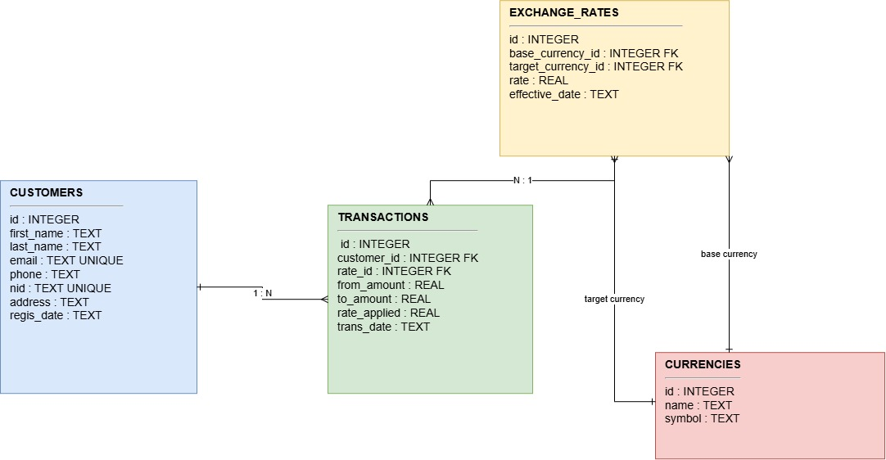

Money Exchange System
----------------------
A simple Money Exchange Management System built with Python and SQLite.

The system stores customer information, supported currencies, exchange rates, and currency exchange transactions in a relational SQLite database.

ER DIAGRAM
-----------

ENTITIES
--------
### CUSTOMERS

Stores information about the people who use the money exchange service. Each customer is uniquely identified and can perform multiple currency exchange transactions.

**Attributes:**

* `id` (PK) — Unique identifier for each customer.
* `first_name` — Customer's first name.
* `last_name` — Customer's last name.
* `email` (Unique) — Customer's email address.
* `phone` — Customer's contact number.
* `nid` (Unique) — Customer's national identification number.
* `address` — Customer's residential or contact address.
* `regis_date` — Date when the customer was registered in the system.

---

### CURRENCIES

Stores the list of currencies supported by the money exchange system. Each currency has a unique identifier and basic information such as its name and symbol.

**Attributes:**

* `id` (PK) — Unique identifier for each currency.
* `name` — Name of the currency, such as US Dollar or New Zealand Dollar.
* `symbol` — Currency symbol, such as `$`, `€`, or `£`.

---

### EXCHANGE_RATES

Stores the exchange rates used to convert one currency into another. The table also keeps the date on which each rate became effective, allowing the system to maintain historical exchange-rate information.

**Attributes:**

* `id` (PK) — Unique identifier for each exchange rate.
* `base_currency_id` (FK → CURRENCIES) — The currency being converted from.
* `target_currency_id` (FK → CURRENCIES) — The currency being converted to.
* `rate` — The conversion rate between the base and target currencies.
* `effective_date` — Date from which the exchange rate is applicable.

---

### TRANSACTIONS

Stores the actual currency exchange transactions performed by customers. Each transaction records the customer, the exchange rate used, the amount exchanged, and the final converted amount.

**Attributes:**

* `id` (PK) — Unique identifier for each transaction.
* `customer_id` (FK → CUSTOMERS) — Identifies the customer who performed the transaction.
* `rate_id` (FK → EXCHANGE_RATES) — Identifies the exchange rate used for the transaction.
* `from_amount` — Amount of the original currency provided by the customer.
* `to_amount` — Amount of the target currency received by the customer.
* `rate_applied` — The exact exchange rate used when the transaction was completed.
* `trans_date` — Date and time when the transaction was performed.

RELATIONSHIPS
------------
1) CUSTOMERS 1 : N TRANSACTIONS
One customer can make many transactions, but each transaction belongs to exactly one customer.
2) TRANSACTIONS N : 1 EXCHANGE_RATES
Many transactions can reuse the same exchange rate record (e.g. all trades happening while a rate is in effect), but each transaction locks in exactly one rate via rate_id. That's also why rate_applied is duplicated on TRANSACTIONS itself — it's a snapshot of the rate at the time of the trade, so historical transactions stay accurate even if the EXCHANGE_RATES table is later updated.
3) EXCHANGE_RATES → CURRENCIES (two FKs, two roles)
Each exchange rate row connects to CURRENCIES twice, in two different roles:
base_currency_id → the currency you're converting from
target_currency_id → the currency you're converting to
This is why there are two separate arrows from EXCHANGE_RATES down to CURRENCIES, labeled "base currency" and "target currency" — it's a common pattern for representing a self-referencing-style relationship through an intermediary, letting you express things like "1 USD = 0.92 EUR" as base_currency_id=USD, target_currency_id=EUR, rate=0.92.