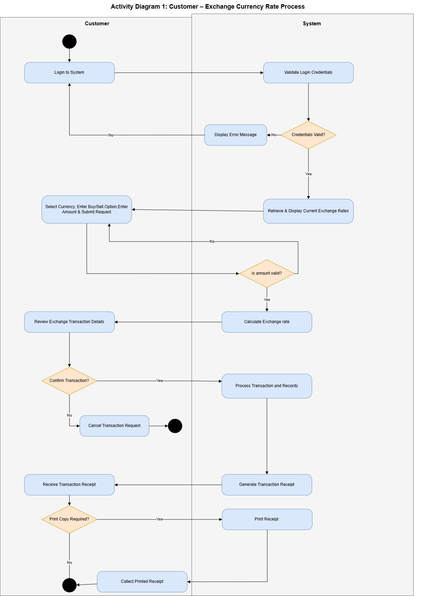
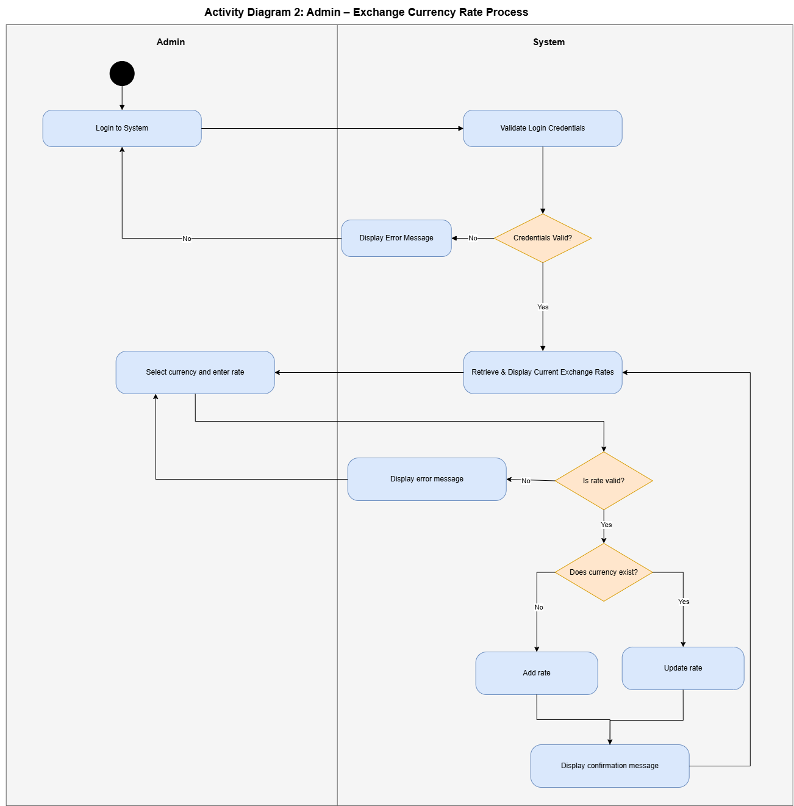
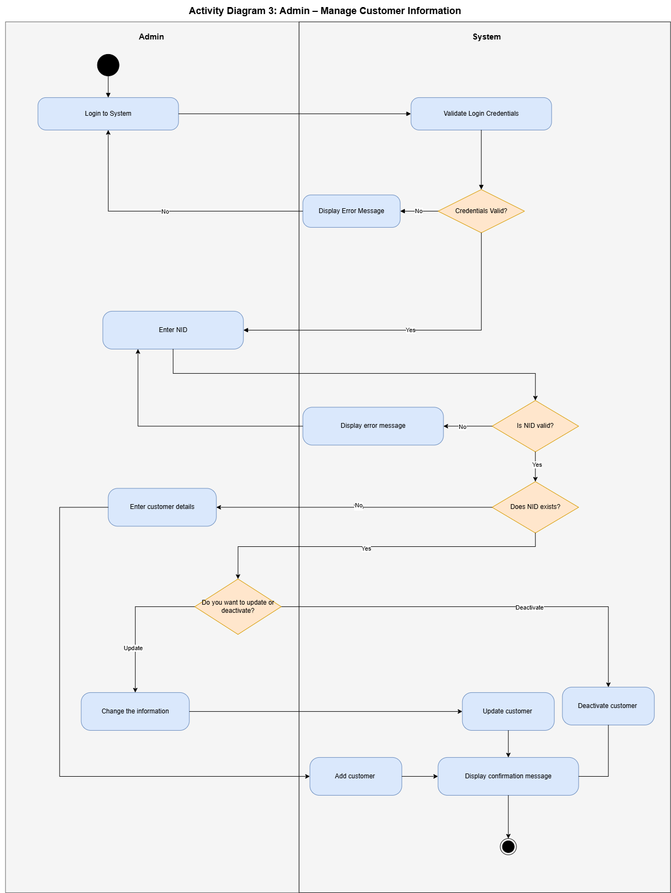

Money Exchange Rate System — Activity Diagrams
----------------------------------------------
The document shows the activity diagrams for money exchange rate system.There are three activity diagrams.
Customer : Activity Diagram 1
Admin : Activity Diagram 2 and Activity Diagram 3

Activity Diagram 1 (Customer)
-----------------------------
Actors: Customer, System

Flow Summary
============

a. Customer login and system validates the credentials.
b. Customer selects the currency, BUY/SELL option and enter the amount. The system will validate the amount.
c. After validation, system calculate the exchange rate and customer review the transaction details.
d. Customer cancel or confirm:
        1. Confirm: Systems processes the transaction and generate receipt.
        2. Cancel: Transaction is cancelled.
e. Customer chooses whether to print ot not:
        1. Yes: System print the receipt
        2. No: Process ends

    

 Activity Diagram 2 (Admin)
-----------------------------
Actors: Admin, System

Flow Summary
============

a. Admin login and system validates the credentials.
b. Admin selects currency and enter the rate. The system validates the rate and currency.
C. If currency already exist, then system update the rate. Otherwise, save the rate.

Activity Diagram 3 (Admin)
-----------------------------
Actors: Admin, System

Flow Summary
============
a. Admin login and system validates the credentials.
b. Admin enter the customer's NID and system validates the nid number and its existance.
c. If nid exists, then admin changes the customer's information, otherwise, add the customer information. System add or update the information accordingly.
d. Admin can also deactivate the customer.

